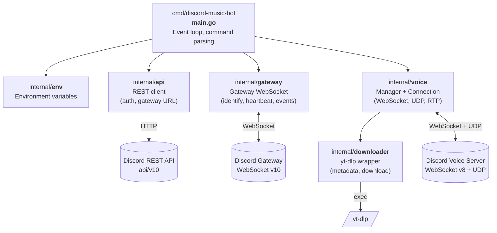
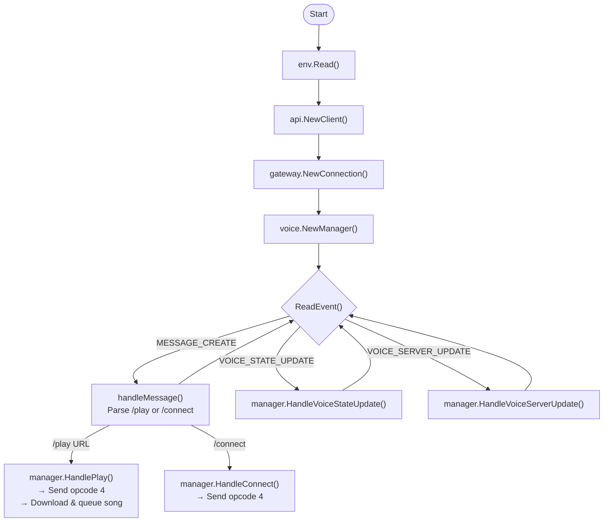
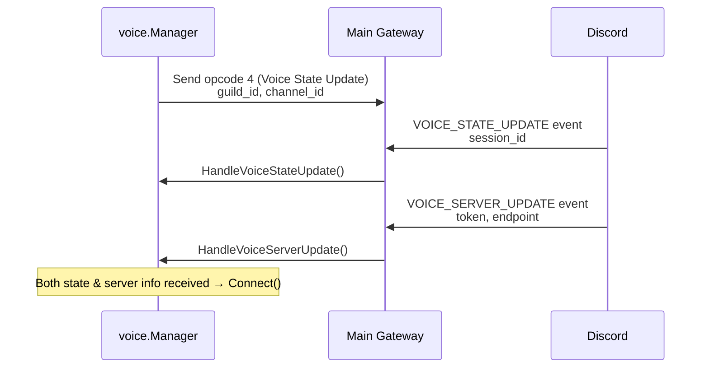
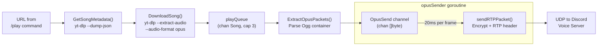

# Architecture

Discord music bot implemented in Go. Connects to Discord's Gateway WebSocket API (v10), joins voice channels, downloads audio via `yt-dlp`, and streams Opus-encoded audio over UDP. All Gateway, REST API, and voice protocol handling is implemented from scratch - no third-party Discord library.

## High-Level Architecture



## Main Event Loop

`main.go` connects to the Gateway, creates a `voice.Manager`, and loops reading events:



Messages are filtered by `GuildId` and `MusicChannelId` from environment variables.

## Gateway Connection Sequence

The main Gateway WebSocket handles identity, heartbeating, and event dispatch.

```mermaid
sequenceDiagram
    participant Bot as Bot (gateway.Connection)
    participant GW as Discord Gateway

    Bot->>GW: WebSocket Dial (wss://gateway.discord.gg/?v=10&encoding=json)
    GW->>Bot: HELLO (op 10) - heartbeat_interval

    rect rgb(40, 40, 60)
        note right of Bot: Heartbeat goroutine
        loop Every heartbeat_interval ms
            Bot->>GW: HEARTBEAT (op 1) - last sequence number
            GW->>Bot: HEARTBEAT_ACK (op 11)
        end
    end

    Bot->>GW: IDENTIFY (op 2) - token, intents, properties
    GW->>Bot: READY (op 0) - session_id, user.id, resume_gateway_url

    loop Event dispatch
        GW->>Bot: Dispatch events (op 0)<br/>MESSAGE_CREATE, VOICE_STATE_UPDATE, etc.
    end
```



Intents (bitmask): `GUILDS | GUILD_VOICE_STATES | GUILD_MESSAGES | MESSAGE_CONTENT`

## Voice Connection Lifecycle

When the bot joins a voice channel, it negotiates a separate WebSocket + UDP connection to the voice server.

### Phase 1: Gateway negotiation



### Phase 2: Voice WebSocket + UDP establishment

```mermaid
sequenceDiagram
    participant Conn as voice.Connection
    participant VGW as Voice Gateway (WSS)
    participant UDP as Voice UDP

    Conn->>VGW: WebSocket Dial (wss://endpoint?v=8)
    VGW->>Conn: HELLO (op 8) - heartbeat_interval

    Conn->>VGW: IDENTIFY (op 0) - server_id, user_id, session_id, token

    rect rgb(40, 40, 60)
        note right of Conn: Voice heartbeat goroutine
        loop Every heartbeat_interval ms
            Conn->>VGW: HEARTBEAT (op 3) - {t: nonce, seq_ack}
            VGW->>Conn: HEARTBEAT_ACK (op 6)
        end
    end

    VGW->>Conn: READY (op 2) - ssrc, ip, port, modes[]

    rect rgb(40, 60, 40)
        note over Conn,UDP: UDP IP Discovery
        Conn->>UDP: 74-byte discovery packet (ssrc)
        UDP->>Conn: Response with external IP + port
    end

    Conn->>VGW: SELECT PROTOCOL (op 1) - udp, ip, port, mode
    VGW->>Conn: SESSION DESCRIPTION (op 4) - secret_key, mode

    note over Conn: Create AEAD cipher (AES-256-GCM or XChaCha20-Poly1305)
    note over Conn: Start opusSender + udpKeepAlive goroutines
    note over Conn: Ready = true
```



Encryption modes (in preference order):
1. `aead_aes256_gcm_rtpsize`
2. `aead_xchacha20_poly1305_rtpsize`

## Audio Playback Pipeline



Timing: Each Opus frame is 20ms (960 samples at 48kHz). The `opusSender` goroutine maintains a ticker to pace frame transmission.

Silence: After all frames are sent, 5 silence frames (`0xF8, 0xFF, 0xFE`) signal end of audio to Discord.

## RTP Packet Structure

Each audio frame is wrapped in an RTP packet with encrypted payload:

```
 0                   1                   2                   3
 0 1 2 3 4 5 6 7 8 9 0 1 2 3 4 5 6 7 8 9 0 1 2 3 4 5 6 7 8 9 0 1
+-+-+-+-+-+-+-+-+-+-+-+-+-+-+-+-+-+-+-+-+-+-+-+-+-+-+-+-+-+-+-+-+
|V=2|P|X|  CC   |M|     PT      |       Sequence Number         |
|  (0x80)       | (0x78=Opus)   |       (big-endian u16)        |
+-+-+-+-+-+-+-+-+-+-+-+-+-+-+-+-+-+-+-+-+-+-+-+-+-+-+-+-+-+-+-+-+
|                           Timestamp                           |
|                  (big-endian u32, +960 per frame)             |
+-+-+-+-+-+-+-+-+-+-+-+-+-+-+-+-+-+-+-+-+-+-+-+-+-+-+-+-+-+-+-+-+
|                              SSRC                             |
|                       (big-endian u32)                        |
+-+-+-+-+-+-+-+-+-+-+-+-+-+-+-+-+-+-+-+-+-+-+-+-+-+-+-+-+-+-+-+-+
|                                                               |
|              AEAD-encrypted Opus frame data                   |
|         (plaintext sealed with header as AAD)                 |
|                                                               |
+-+-+-+-+-+-+-+-+-+-+-+-+-+-+-+-+-+-+-+-+-+-+-+-+-+-+-+-+-+-+-+-+
|                     Nonce suffix (4 bytes)                    |
+-+-+-+-+-+-+-+-+-+-+-+-+-+-+-+-+-+-+-+-+-+-+-+-+-+-+-+-+-+-+-+-+
```

- Header (12 bytes): Version, payload type `0x78`, sequence, timestamp, SSRC
- Encrypted payload: Opus frame encrypted with AEAD. The 12-byte RTP header is used as additional authenticated data (AAD)
- Nonce suffix (4 bytes): Monotonically incrementing counter, appended after the ciphertext

The sequence number, timestamp, and nonce are all initialized to random values at connection setup and increment with each packet.
